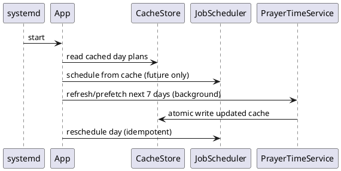
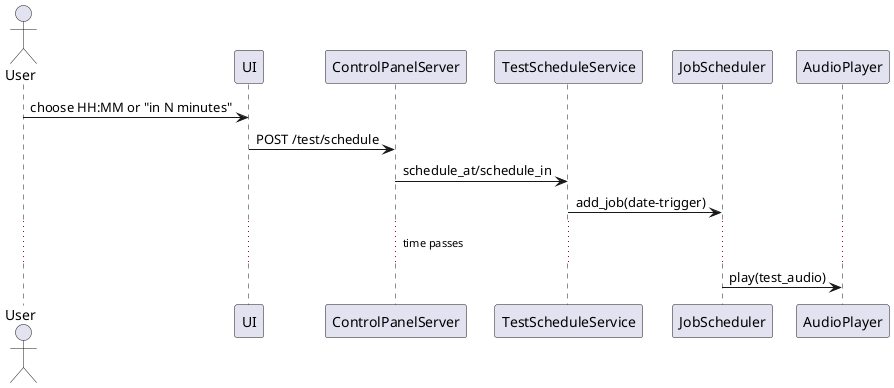

# PrayerHub Mini / Prototype (8-hour hackathon)
**Mini design doc + project plan + ticket list (agent-ready)**  
Version: 2025-12-25

Target: reliable offline-first audio scheduling (Adhan + Quran + notifications) on a small Raspberry Pi device, with a LAN control panel, test-scheduler feature, TDD + OOP, and a GitHub Actions pipeline that produces an installable device bundle artifact.

---

## 0) Decisions I made for you (so the plan is executable)

### Device + OS (chosen)
- **Device:** Raspberry Pi Zero 2 W (works on Pi 3/4 too)
- **OS:** Raspberry Pi OS Lite 64-bit (Bookworm) + systemd
- **Audio stack:** PipeWire is common on Bookworm. We will **support PipeWire first** via `wpctl`, and also support PulseAudio via `pactl` as a fallback.

Why: fastest path to “it runs on a real device” without needing a screen.

### Config format (chosen)
- **YAML** with **multiple files** and a deterministic merge order:
  1. `/etc/prayerhub/config.yml` (base)
  2. `/etc/prayerhub/config.d/*.yml` (overlay, sorted by filename)
  3. optional `/etc/prayerhub/secrets.yml` (if present, last)

Rationale: you asked for flexibility, but also want a simple default. This gives both.

### Prayer times source (chosen)
- Use your **prayer-api** endpoints as the source of truth, but remain offline-first by caching ranges locally.
- Prefer `/api/v1/times/range/` to prefetch multiple days (7-day rolling cache). If range fails, fall back to per-day `/api/v1/times/date/`. If network fails, fall back to cache.

---

## 1) Goals and non-goals

### Must-haves
- Fetch prayer times for Sri Lanka (city + madhab) and **cache** them locally.
- Run fully offline using the cached data.
- Schedule daily events:
  - Adhan: fajr (lower volume), dhuhr, asr, maghrib, isha
  - Quran recitations: configurable fixed times + file path
  - Notifications: sunrise, sunset, islamic midnight, tahajjud (if configured)
- Bluetooth: auto-connect to a fixed speaker; reconnect with backoff.
- **Scheduler test feature**:
  - schedule a one-off “test audio” at a chosen time
  - also allow “in N minutes”
- **Control panel**:
  - very basic HTML UI, LAN only
  - fixed username + password (hash in config)
  - controls: schedule test audio + view status (plus optional volume + play-now)
- TDD + OOP: core logic unit-tested; interfaces for external effects.
- GitHub repo + GitHub Actions:
  - run tests
  - build an **install bundle** artifact

### Non-goals for this 8-hour build
- Touchscreen UI
- User management / multi-user
- Remote access over the Internet
- Telegram bot / push notifications
- Multi-device syncing

---

## 2) Architecture overview

### Runtime processes
- **One Python process**:
  - APScheduler for jobs
  - Flask for control panel (same process, separate thread)

### Modules (OOP + testability)
- `ConfigLoader`: loads and merges YAML files into typed config.
- `CacheStore`: atomic JSON read/write.
- `PrayerApiClient`: HTTP client for prayer-api.
- `PrayerTimeService`: chooses API strategy, parses responses, persists cache, exposes “day plan”.
- `AudioRouter`: chooses PipeWire or PulseAudio and sets sink/volume.
- `BluetoothManager`: connect/trust speaker and verify connectivity.
- `AudioPlayer`: plays files, enforces single playback, supports timeouts.
- `JobScheduler`: schedules daily jobs and refresh jobs.
- `TestScheduleService`: one-off test jobs + persistence.
- `ControlPanelServer`: Flask UI + auth + endpoints.
- `App`: composition root.

### Dependency inversion
Use `typing.Protocol` for anything external:
- `Clock` (time)
- `HttpClient` (requests wrapper)
- `CommandRunner` (subprocess wrapper)
- `FileSystem` (optional: to unit test atomic writes)

---

## 3) Prayer API integration

### Endpoints we will use
- `GET /api/v1/times/range/?madhab=shafi&city=colombo&start=YYYY-MM-DD&end=YYYY-MM-DD`
- `GET /api/v1/times/date/?madhab=shafi&city=colombo&date=YYYY-MM-DD`

Expected schema (simplified):
```json
{
  "date": "2025-09-23",
  "madhab": "shafi",
  "city": "colombo",
  "times": {
    "fajr": "04:58",
    "sunrise": "06:10",
    "dhuhr": "12:05",
    "asr": "15:30",
    "maghrib": "18:03",
    "isha": "19:14",
    "tahajjud": "01:20",
    "midnight": "23:30"
  }
}
```

### Design choice: “use provided extras, compute if missing”
- If API returns `tahajjud`/`midnight`, we store them and use them.
- If missing, we compute locally (so we are resilient if the API format changes).

### Pitfalls
- The API may return HTTP 400 for unsupported city/madhab/date.
- The dataset may be limited to a supported year; treat that as “API not available for this day” and fall back to cache.

---

## 4) Fail-safes (mandatory)

### Offline-first and resilience
- Cache the next **7 days** (rolling window). Daily refresh extends the window.
- Startup sequence:
  1) schedule from cache immediately (no network needed)
  2) refresh in background and reschedule if new data arrives
- If cache missing and API unavailable: keep service alive and retry periodically (do not crash-loop).

### Scheduler correctness
- Only schedule **future** events.
- Use `coalesce=True` and a small `misfire_grace_time` so missed events on reboot do not all fire.
- Every job handler wraps exceptions and returns (never kills scheduler thread).

### Audio and bluetooth safety
- Playback guarded by a lock (no overlaps).
- All subprocess calls have timeouts.
- Bluetooth connect attempts use backoff and never block the scheduler indefinitely.
- If bluetooth is disconnected at trigger time:
  - attempt a quick reconnect once
  - if still disconnected, skip playback and log

### Control panel safety
- If control panel config is invalid (missing password hash), do not start the HTTP server.
- LAN only (bind to 0.0.0.0 but expect private IP); no reverse proxy in this scope.

---

## 5) High-level class diagram (PlantUML)

```plantuml
@startuml
class App { +start(); +stop() }

class ConfigLoader { +load(): AppConfig }
class CacheStore { +read(key): dict?; +write(key, data): void }

class PrayerApiClient { +get_date(d): ApiDay; +get_range(start,end): ApiRange }
class PrayerTimeService { +prefetch(days): void; +get_day(date): DayPlan }

class BluetoothManager { +ensure_connected(): bool }
class AudioRouter { +set_master_volume(pct); +ensure_default_sink(): void }
class AudioPlayer { +play(path, pct): bool; +stop(): void }

class JobScheduler { +start(); +schedule_day(plan); +refresh_and_reschedule() }
class TestScheduleService { +schedule_at(dt): str; +schedule_in(mins): str; +list(): list; +cancel(id): bool }

class ControlPanelServer { +start() }

App --> ConfigLoader
App --> CacheStore
App --> PrayerTimeService
PrayerTimeService --> PrayerApiClient
App --> BluetoothManager
App --> AudioRouter
App --> AudioPlayer
App --> JobScheduler
JobScheduler --> AudioPlayer
JobScheduler --> BluetoothManager
JobScheduler --> PrayerTimeService
App --> TestScheduleService
TestScheduleService --> JobScheduler
App --> ControlPanelServer
ControlPanelServer --> TestScheduleService
ControlPanelServer --> AudioPlayer
@enduml
```

---

## 6) Key sequences (PlantUML)

### Startup: schedule-from-cache then refresh


### Control panel: schedule a test audio


---

## 7) Configuration layout

### Files
- `/etc/prayerhub/config.yml`
- `/etc/prayerhub/config.d/10-audio.yml` (example)
- `/etc/prayerhub/secrets.yml` (optional)

### Merge rules (must implement)
- Deep-merge dictionaries.
- Lists are replaced (not merged).
- Later files win.

### Minimal base config.yml (example)
```yaml
location:
  city: "colombo"   # prayer-api expects "colombo" or "others"
  madhab: "shafi"   # "hanafi" or "shafi"
  timezone: "Asia/Colombo"

api:
  base_url: "http://prayer-api-lb-1574385576.us-east-1.elb.amazonaws.com"
  timeout_seconds: 8
  max_retries: 4
  prefetch_days: 7

audio:
  test_audio: "data/audio/test_beep.mp3"
  connected_tone: "data/audio/connected.mp3"
  playback_timeout_seconds: 300
  playback_timeout_strategy: "auto" # fixed or auto (advanced users only)
  playback_timeout_buffer_seconds: 5
  volumes:
    master_percent: 60
    adhan_percent: 85
    fajr_adhan_percent: 60
    quran_percent: 55
    notification_percent: 50
    test_percent: 70

bluetooth:
  device_mac: "AA:BB:CC:DD:EE:FF"
  ensure_default_sink: true

control_panel:
  enabled: true
  host: "0.0.0.0"
  port: 8080
  auth:
    username: "admin"
    password_hash: "pbkdf2:sha256:..." # generate once
  test_scheduler:
    max_pending_tests: 10
    max_minutes_ahead: 1440
```

Validation rules:
- all percent fields are 0-100
- audio files exist
- `device_mac` format is valid
- if control panel enabled: username non-empty, password_hash present
- `playback_timeout_strategy` is `fixed` or `auto`

---

## 8) CI/CD and artifact (GitHub Actions)

### Build output
- `prayerhub-install-bundle.zip` containing:
  - a built wheel (preferred) or sdist for this app
  - `requirements.txt`
  - `deploy/install.sh`
  - `deploy/prayerhub.service`
  - `config.example.yml`
  - `README_INSTALL.md`

### Install flow on device
- `install.sh` must be **idempotent**:
  - creates `/opt/prayerhub` if missing
  - creates venv
  - installs requirements
  - copies systemd unit
  - creates `/etc/prayerhub` and copies sample config if missing
  - `systemctl enable --now prayerhub`

### GitHub Actions jobs
- `ci.yml` on every push/PR:
  - install deps
  - run `pytest`
  - build bundle
  - upload artifact

---

## 9) Repository structure (recommended)

```
prayerhub-mini/
  README.md
  spec.md
  pyproject.toml
  src/prayerhub/...
  templates/...
  tests/...
  deploy/
    install.sh
    prayerhub.service
  data/audio/
    test_beep.mp3
    connected.mp3
  .github/workflows/ci.yml
```

---

## 10) 8-hour hackathon plan (tickets in dependency order)

Rules for every ticket:
- **TDD**: write failing tests first, then implement.
- **OOP**: classes above, no giant modules.
- **No direct subprocess/requests in core logic**; always via an interface to make tests fast.
- Each ticket ends with “Definition of Done” so an agent can stop cleanly.

> Total target: ~7h45m + 15m buffer.

---

### T0 - Device baseline (Pi OS + audio + BT)
**Estimate:** 45 min  
**Depends on:** nothing  
**Context7 topics:**  
- Raspberry Pi OS Lite Bookworm setup, SSH, Wi-Fi  
- `bluetoothctl` pair/trust/connect  
- PipeWire `wpctl` volume, default sink  
- PulseAudio `pactl` volume, default sink  
- `mpg123` usage

**Steps**
1. Flash Raspberry Pi OS Lite 64-bit, enable SSH, set timezone Asia/Colombo.
2. `sudo apt-get update`
3. Install essentials:
   - `python3 python3-venv git`
   - `bluez` (and `bluetoothctl` is included)
   - `mpg123`
   - for PipeWire tooling: `wireplumber pipewire-audio` (usually already)
   - install PulseAudio tools too (optional): `pulseaudio-utils`
4. Pair speaker:
   - `bluetoothctl`
   - `power on`, `agent on`, `default-agent`
   - `scan on`, `pair <MAC>`, `trust <MAC>`, `connect <MAC>`
5. Verify audio:
   - `mpg123 /usr/share/sounds/alsa/Front_Center.wav` (or any local file)

**Pitfalls**
- Bluetooth audio routing differs across OS images. We handle this later with `AudioRouter` detecting `wpctl` vs `pactl`.

**Definition of Done**
- Speaker paired + trusted, a sound plays through it.

---

### T1 - Repo scaffold + CI that uploads a bundle artifact
**Estimate:** 35 min  
**Depends on:** T0 (git tools known, but can be done on laptop too)  
**Context7 topics:**  
- GitHub Actions `actions/setup-python`, `upload-artifact`  
- `pytest` basics  
- `pyproject.toml` src layout

**Steps**
1. Create repo `prayerhub-mini` with src layout.
2. Add `pyproject.toml` with dependencies (requests, pyyaml, apscheduler, flask, werkzeug, pytest).
3. Add a trivial `tests/test_smoke.py` that imports `prayerhub`.
4. Add `.github/workflows/ci.yml`:
   - run pytest
   - build tar.gz bundle
   - upload artifact

**Pitfalls**
- Keep dependencies pure-Python to avoid compile pain on device.

**Definition of Done**
- Pushing to GitHub runs CI and produces an artifact.

---

### T2 - ConfigLoader (multi-file merge) + LoggerFactory
**Estimate:** 55 min  
**Depends on:** T1  
**Context7 topics:**  
- PyYAML `safe_load`  
- dataclasses + typing  
- Python logging RotatingFileHandler  
- Werkzeug `generate_password_hash`, `check_password_hash`

**TDD (tests first)**
- loads base config.yml
- overlays config.d files in lexical order
- missing test_audio path fails validation
- control panel enabled but missing password_hash fails validation
- volume percent out of range fails validation

**Steps**
1. Define typed dataclasses for config models.
2. Implement deep-merge for dicts (lists replaced).
3. Implement path discovery:
   - default root `/etc/prayerhub`, but allow `PRAYERHUB_CONFIG_DIR`
4. Validate config; produce a single `AppConfig`.
5. Implement `LoggerFactory` (console + optional rotating file).

**Pitfalls**
- Don’t log secrets (password hash ok, but no plaintext passwords).

**Definition of Done**
- Config loading + validation is fully unit tested.

---

### T3 - CacheStore (atomic JSON persistence)
**Estimate:** 25 min  
**Depends on:** T2  
**Context7 topics:**  
- atomic file write with temp + fsync + rename  
- pathlib, json module

**TDD**
- write then read returns same payload
- corrupt JSON does not crash (returns None + logs)

**Steps**
1. Implement `CacheStore` with atomic writes.
2. Use a predictable folder: `/var/lib/prayerhub/cache` (or `/opt/prayerhub/cache` for prototype).

**Definition of Done**
- Cache never ends up partial; corruption is handled.

---

### T4 - PrayerApiClient + PrayerTimeService (prefetch + parse + derived fallback)
**Estimate:** 1h 10m  
**Depends on:** T2, T3  
**Context7 topics:**  
- `requests` timeouts, retries  
- Python `zoneinfo`  
- datetime parsing and formatting  
- exponential backoff

**TDD**
- parse “date endpoint” response into a DayPlan
- parse “range endpoint” response list
- if range fails, fall back to per-date calls
- if network fails, fall back to cache
- derived-time fallback works if API omits midnight/tahajjud

**Steps**
1. Implement `PrayerApiClient` with:
   - `get_range(start,end)`
   - `get_date(date)`
2. Implement `PrayerTimeService.prefetch(days=N)`:
   - call range for today..today+N
   - write each day plan into cache by date key
3. Implement derived-time calculations (only used if missing):
   - midnight: midpoint between maghrib(today) and fajr(tomorrow)
   - tahajjud start: fajr(tomorrow) minus last-third of night
4. Provide `get_day(date)` to return cached plan.

**Pitfalls**
- Midnight and tahajjud require tomorrow’s fajr. If missing, skip these events gracefully.

**Definition of Done**
- With network disabled, service can schedule from cache.

---

### T5 - AudioRouter + AudioPlayer (PipeWire/PulseAudio detection, lock, timeouts)
**Estimate:** 55 min  
**Depends on:** T2  
**Context7 topics:**  
- Python `subprocess.run` timeout  
- PipeWire `wpctl`  
- PulseAudio `pactl`  
- `mpg123`

**TDD**
- AudioRouter selects wpctl when available, else pactl
- AudioPlayer refuses to play missing file
- AudioPlayer enforces single playback (lock)

**Steps**
1. Implement `CommandRunner` interface + real runner.
2. Implement `AudioRouter`:
   - detect: if `wpctl` in PATH -> PipeWire
   - else if `pactl` -> PulseAudio
3. Implement `AudioPlayer.play(path, volume_percent)`:
   - set volume
   - run mpg123 with timeout
4. Ensure `play()` never blocks forever; always timeout.

**Pitfalls**
- Running under systemd can have a different audio session. In T10, we ensure service user and environment are correct.

**Definition of Done**
- Unit tests pass; manual “play test beep” works on device.

---

### T6 - BluetoothManager (connect, verify, backoff)
**Estimate:** 55 min  
**Depends on:** T5, T2  
**Context7 topics:**  
- `bluetoothctl` scripting  
- backoff strategies  
- device MAC validation

**TDD**
- if already connected, ensure_connected returns true without connecting
- if not connected, attempts connect and times out
- backoff list respected

**Steps**
1. Implement `BluetoothManager` that runs:
   - `bluetoothctl info <MAC>` to infer connection state
   - if disconnected: `bluetoothctl connect <MAC>` with timeout
2. If configured, call `AudioRouter.ensure_default_sink()` after connect.

**Definition of Done**
- Turning the speaker off/on recovers without rebooting the service.

---

### T7 - JobScheduler (daily schedule, refresh job, idempotent reschedule)
**Estimate:** 1h 00m  
**Depends on:** T4, T5, T6  
**Context7 topics:**  
- APScheduler BackgroundScheduler  
- job ids, replacing jobs  
- misfire_grace_time, coalesce, max_instances

**TDD**
- given a DayPlan, scheduler creates expected jobs (future only)
- rescheduling doesn’t duplicate jobs
- old jobs removed

**Steps**
1. Wrap APScheduler in `JobScheduler`.
2. Implement “schedule_day(plan)” with stable job ids:
   - `adhan_fajr_YYYYMMDD`, etc.
3. Add daily refresh job at 00:05 local:
   - prefetch next 7 days
   - reschedule today and tomorrow

**Pitfalls**
- Avoid accumulating jobs across days. Always remove jobs for prior dates.

**Definition of Done**
- Dry-run prints next triggers; real run fires and plays.

---

### T8 - TestScheduleService (one-off test jobs + optional persistence)
**Estimate:** 35 min  
**Depends on:** T7  
**Context7 topics:**  
- APScheduler date trigger  
- datetime parsing HH:MM  
- input validation

**TDD**
- rejects past times
- enforces max_pending_tests
- schedule_in works
- cancel removes job

**Steps**
1. Add `schedule_at(dt)` and `schedule_in(minutes)`.
2. Job handler plays `audio.test_audio` at `test_percent`.
3. Optional: persist pending tests to cache and restore on startup.

**Definition of Done**
- You can schedule a test for +2 minutes and hear it.

---

### T9 - ControlPanelServer (LAN UI + auth + test scheduling UI)
**Estimate:** 55 min  
**Depends on:** T8  
**Context7 topics:**  
- Flask sessions + templates  
- Werkzeug password hashing  
- form POST handling

**UI pages**
- `/login`: login form
- `/`: status (bluetooth, next events, last refresh)
- `/test`: schedule test HH:MM today/tomorrow, or “in N minutes”; list + cancel
- Optional: `/controls` volume up/down, play now

**TDD (minimal)**
- protected pages redirect to login
- successful login allows scheduling test
- invalid credentials denied

**Pitfalls**
- Keep it server-rendered. No JS frameworks.

**Definition of Done**
- From phone/laptop on LAN, you can schedule and cancel test audio.

---

### T10 - Deploy scripts + systemd unit (install bundle installs cleanly)
**Estimate:** 45 min  
**Depends on:** T1..T9  
**Context7 topics:**  
- systemd service units  
- Linux permissions, users/groups  
- idempotent bash scripts

**Steps**
1. `deploy/prayerhub.service`:
   - `Restart=always`
   - `WorkingDirectory=/opt/prayerhub`
   - `ExecStart=/opt/prayerhub/.venv/bin/python -m prayerhub`
2. `deploy/install.sh`:
   - create `/opt/prayerhub` and `/etc/prayerhub`
   - install apt deps (mpg123, bluez)
   - create venv and pip install
   - copy unit + enable service

**Pitfalls**
- Audio services sometimes need user session. For hackathon:
  - run service as the default `pi` user (or a dedicated user in audio group)
  - document this clearly in install.sh comments

**Definition of Done**
- Fresh device install: `install.sh` leads to a running service.

---

### T11 - End-to-end validation checklist (manual + automated smoke)
**Estimate:** 25 min  
**Depends on:** T10  
**Context7 topics:**  
- pytest markers, smoke tests  
- curl usage for control panel

**Steps**
1. Manual checklist:
   - boot -> service active
   - control panel login works
   - schedule test in 2 minutes, hear it
   - disable Wi-Fi, reboot, still schedules from cache
2. Add a `pytest -m smoke` test that:
   - builds an in-memory DayPlan and ensures scheduler creates jobs

**Definition of Done**
- You have high confidence it works before demo.

---

### T12 - App composition + CLI entrypoint
**Estimate:** 55 min  
**Depends on:** T2..T11  
**Context7 topics:**  
- argparse basics  
- Python logging setup  

**TDD**
- app loads config from default path and respects `PRAYERHUB_CONFIG_DIR`
- `--dry-run` starts scheduler without playing audio
- app exits cleanly on config validation error

**Steps**
1. Add `prayerhub.app` module with `main()` and `python -m prayerhub.app` support.
2. Compose ConfigLoader, LoggerFactory, CacheStore, PrayerApiClient, PrayerTimeService, JobScheduler, TestScheduleService, and ControlPanelServer.
3. Wire a dry-run flag that schedules jobs but no-ops audio playback.
4. Document the entry point in `README.md`.

**Pitfalls**
- Avoid importing Flask or APScheduler at module import time; only within `main()`.

**Definition of Done**
- `python -m prayerhub.app --config ./config.yml --dry-run` runs without errors and lists scheduled jobs.

---

### T13 - Audio asset config + validation
**Estimate:** 45 min  
**Depends on:** T2, T5  
**Context7 topics:**  
- dataclasses validation  
- pathlib  

**TDD**
- missing adhan or quran audio files fail validation
- volume percent out of range fails validation (adhans + quran + notifications)

**Steps**
1. Extend config schema to include:
   - adhan audio per prayer (fajr, dhuhr, asr, maghrib, isha)
   - quran schedule list with time + file
   - notification audio mapping (sunrise, sunset, midnight, tahajjud)
2. Validate that required files exist (relative to app working dir).
3. Update `config.example.yml` with placeholders.

**Pitfalls**
- Keep list merging consistent: config overlays replace lists.

**Definition of Done**
- Config validation fails fast on missing required audio files.

---

### T14 - Playback handlers + Bluetooth reconnect rule
**Estimate:** 55 min  
**Depends on:** T5, T6, T7, T13  
**Context7 topics:**  
- APScheduler job handlers  
- subprocess timeout handling  

**TDD**
- handler attempts one Bluetooth reconnect on disconnect then skips
- handler never raises exceptions to the scheduler thread
- handler respects no-overlap lock in AudioPlayer

**Steps**
1. Implement a job handler for adhan/quran/notification events.
2. On fire: ensure Bluetooth is connected, set volume per event, play audio.
3. If Bluetooth is down: attempt one reconnect; if still down, log and skip.

**Pitfalls**
- Do not let handler exceptions bubble; always log and return.

**Definition of Done**
- On device, a scheduled adhan plays with the correct volume and reconnect logic.

---

### T15 - Control panel status + controls
**Estimate:** 60 min  
**Depends on:** T9, T14  
**Context7 topics:**  
- Flask templates  
- Werkzeug auth  

**TDD**
- dashboard shows next events and pending test jobs
- `/controls` volume up/down triggers router
- `/controls` play-now triggers test audio

**Steps**
1. Extend dashboard with status, next scheduled events, and a log tail.
2. Add `/controls` actions for volume up/down and play-now adhan/quran.
3. Optional: support token header for curl automation.

**Pitfalls**
- Never log passwords or tokens.

**Definition of Done**
- Control panel shows status and can trigger audio/volume actions.

---

### T16 - Startup flow: cache-first schedule + background refresh
**Estimate:** 45 min  
**Depends on:** T4, T7, T12  
**Context7 topics:**  
- threading  
- APScheduler coalesce/misfire  

**TDD**
- startup schedules jobs from cache without network
- refresh job updates cache then reschedules today/tomorrow

**Steps**
1. On app start, read cached DayPlans and schedule future jobs.
2. Refresh in background and reschedule when new data arrives.
3. Ensure scheduler jobs remain idempotent (no duplicates).

**Pitfalls**
- Avoid scheduling past events after refresh.

**Definition of Done**
- Offline restart still produces a valid schedule from cache.

---

### T17 - Bundle assets + install docs
**Estimate:** 40 min  
**Depends on:** T13, T10  
**Context7 topics:**  
- zip packaging  
- bash idempotency  

**TDD**
- bundle includes audio assets in `data/audio/`

**Steps**
1. Add `data/audio/test_beep.mp3` and `data/audio/connected.mp3` (small files).
2. Update `deploy/build_bundle.sh` to include `data/audio/`.
3. Update `README_INSTALL.md` with exact device steps and file locations.

**Pitfalls**
- Keep audio files small to avoid heavy artifacts.

**Definition of Done**
- CI artifact contains audio assets and install steps are clear.

---

### T18 - Play test audio on scheduled test jobs
**Estimate:** 35 min  
**Depends on:** T8, T14  
**Context7 topics:**  
- APScheduler DateTrigger  
- subprocess timeout handling  

**TDD**
- test job fires and uses `audio.test_audio`
- Bluetooth reconnect attempted once, skip on failure

**Steps**
1. Wire `TestScheduleService` handler to call `PlaybackHandler` with `test_audio`.
2. Ensure volume uses `audio.volumes.test_percent`.
3. Update `/test` UI to show last test job status (optional).

**Pitfalls**
- Keep handler non-blocking; no unbounded waits.

**Definition of Done**
- Scheduling a test in 2 minutes plays `audio.test_audio` on device.

---

### T19 - Quran schedule job creation
**Estimate:** 35 min  
**Depends on:** T7, T13  
**Context7 topics:**  
- APScheduler date triggers  

**TDD**
- quran schedule entries create jobs at configured times
- quran jobs use `quran@HH:MM` naming convention

**Steps**
1. Extend `JobScheduler.schedule_day()` to add Quran jobs for the day.
2. Use stable job IDs: `quran_YYYYMMDD_HHMM`.
3. Ensure quran jobs respect “future only” logic.

**Pitfalls**
- Avoid duplicating quran jobs on reschedule.

**Definition of Done**
- Daily schedule includes quran recitations at configured times.

---

### T20 - Scheduler start when control panel enabled
**Estimate:** 20 min  
**Depends on:** T9, T12, T16  
**Context7 topics:**  
- Flask app lifecycle  

**TDD**
- scheduler starts even when control panel is enabled

**Steps**
1. Start APScheduler before `server.app.run()`.
2. Ensure scheduler thread stays alive while Flask runs.

**Pitfalls**
- Avoid double-starting scheduler in tests.

**Definition of Done**
- Jobs fire with the control panel running.

---

### T21 - File logging + dashboard tail wiring
**Estimate:** 30 min  
**Depends on:** T2, T15  
**Context7 topics:**  
- Python logging handlers  

**TDD**
- log file path config enables file handler
- dashboard shows last N log lines

**Steps**
1. Add optional `logging.file_path` config (or env override).
2. Initialize `LoggerFactory` with file handler when configured.
3. Pass log path into ControlPanelServer.

**Pitfalls**
- Don’t log secrets; avoid unbounded log growth.

**Definition of Done**
- Control panel shows a real log tail from a file.

---

### T22 - Poetry migration: single source of truth
**Estimate:** 35 min  
**Depends on:** none  
**Context7 topics:**  
- none  

**TDD**
- N/A (config-only change)

**Steps**
1. Make `pyproject.toml` the sole source of metadata and dependencies.
2. Move any misplaced config out of `poetry.toml` into `pyproject.toml`.
3. Generate `poetry.lock` and remove or clearly mark `requirements.txt` as generated.

**Pitfalls**
- Avoid breaking `src/` package discovery.

**Definition of Done**
- `poetry check` passes and `poetry install` works in a clean environment.

---

### T23 - Poetry build + export for bundle/CI
**Estimate:** 35 min  
**Depends on:** T22  
**Context7 topics:**  
- none  

**TDD**
- bundle contains a wheel built by Poetry and a generated `requirements.txt`.

**Steps**
1. Update `deploy/build_bundle.sh` to use `poetry build` and `poetry export`.
2. Update CI to install Poetry and use it for tests/build.
3. Update `README.md` setup/build instructions to Poetry-first commands.

**Pitfalls**
- Keep bundle deterministic; avoid local path dependencies.

**Definition of Done**
- CI builds the install bundle using Poetry without pip/venv steps.

---

### T24 - Installer aligns with Poetry outputs
**Estimate:** 20 min  
**Depends on:** T23  
**Context7 topics:**  
- none  

**TDD**
- N/A (shell change)

**Steps**
1. Install the bundled wheel into the device venv.
2. Use the exported `requirements.txt` only as a fallback.
3. Update `README_INSTALL.md` to reflect the new artifact contents.

**Pitfalls**
- Ensure install remains idempotent on the device.

**Definition of Done**
- Device install works with the Poetry-built bundle.

---

### T25 - Audio playback fallback to ffplay
**Estimate:** 25 min  
**Depends on:** T5  
**Context7 topics:**  
- none  

**TDD**
- when mpg123 is missing, ffplay is used
- playback logs a clear error if neither backend is available

**Steps**
1. Extend AudioPlayer to check for ffplay when mpg123 is missing.
2. Keep timeout behavior consistent across backends.

**Pitfalls**
- Avoid blocking playback when neither tool is installed; log and return false.

**Definition of Done**
- Device can play audio with either mpg123 or ffplay installed.

---

### T26 - /status endpoint includes test jobs
**Estimate:** 25 min  
**Depends on:** T9, T15  
**Context7 topics:**  
- none  

**TDD**
- /status requires login
- response includes pending test job ids

**Steps**
1. Add a /status view that renders a minimal status page.
2. Include next scheduled jobs and test jobs.

**Pitfalls**
- Keep auth consistent with other pages.

**Definition of Done**
- /status shows test jobs and next events when logged in.

---

### T27 - Controls: play-now for Quran and test audio
**Estimate:** 20 min  
**Depends on:** T15, T18  
**Context7 topics:**  
- none  

**TDD**
- controls page posts can trigger quran@test_time and test_audio

**Steps**
1. Add test audio and Quran options to the controls form.
2. Wire play-now handler to accept these events safely.

**Pitfalls**
- Validate event names to avoid arbitrary playback.

**Definition of Done**
- Control panel can trigger a Quran sample and test audio on demand.

---

### T28 - Connected tone on successful Bluetooth connect
**Estimate:** 25 min  
**Depends on:** T6, T14  
**Context7 topics:**  
- none  

**TDD**
- connected tone plays after ensure_connected succeeds
- skips tone if audio file missing

**Steps**
1. Invoke PlaybackHandler or AudioPlayer to play connected_tone on connect.
2. Ensure this does not block scheduler threads.

**Pitfalls**
- Avoid infinite loops if Bluetooth flaps.

**Definition of Done**
- Successful Bluetooth connect plays the configured tone once.

---

### T29 - API retry/backoff uses max_retries
**Estimate:** 30 min  
**Depends on:** T4  
**Context7 topics:**  
- none  

**TDD**
- retries occur up to max_retries
- backoff delay increases on failure

**Steps**
1. Implement retry/backoff in PrayerApiClient (or wrapper).
2. Use config.api.max_retries to drive attempts.

**Pitfalls**
- Keep total request time bounded.

**Definition of Done**
- API client retries on transient failure and respects max_retries.

---

### T30 - Timezone handling for prayer times
**Estimate:** 30 min  
**Depends on:** T4, T12  
**Context7 topics:**  
- python stdlib zoneinfo  

**TDD**
- times are interpreted in the configured timezone
- schedule uses timezone-aware datetimes

**Steps**
1. Use config.location.timezone to localize times.
2. Ensure scheduler uses timezone-aware datetimes consistently.

**Pitfalls**
- Avoid mixing naive and aware datetimes.

**Definition of Done**
- Scheduled jobs fire according to configured timezone.

---

### T31 - CacheStore fsync for atomic writes
**Estimate:** 20 min  
**Depends on:** T3  
**Context7 topics:**  
- python stdlib file I/O  

**TDD**
- write uses fsync before rename

**Steps**
1. Update CacheStore.write to fsync the temp file before replace.

**Pitfalls**
- Keep behavior cross-platform and tested.

**Definition of Done**
- Cache writes are fully atomic with fsync protection.

---

### T32 - Sunset notification offset (20 minutes before Maghrib)
**Estimate:** 25 min  
**Depends on:** T4, T7  
**Context7 topics:**  
- datetime arithmetic  

**TDD**
- when API does not provide sunset time, schedule sunset notification at maghrib minus 20 minutes
- sunset notification uses the configured sunset audio (adhkar/duas)

**Steps**
1. Detect when `sunset` is missing in the DayPlan times.
2. Derive `sunset` as `maghrib - 20 minutes` for that day.
3. Ensure scheduler uses the derived sunset time for the notification job.

**Pitfalls**
- Avoid scheduling in the past; keep existing “future only” behavior.

**Definition of Done**
- Sunset notification consistently fires 20 minutes before Maghrib when API lacks sunset.

---

### T33 - Allow disabling audio playback timeout
**Estimate:** 25 min  
**Depends on:** T5, T14  
**Context7 topics:**  
- subprocess timeouts  

**TDD**
- when `audio.playback_timeout_seconds` is 0, audio playback runs without a timeout
- positive timeout still enforces limits

**Steps**
1. Treat `audio.playback_timeout_seconds: 0` as “no timeout”.
2. Pass `None` to subprocess when timeout is disabled.
3. Update config validation and docs to reflect the new behavior.

**Pitfalls**
- Keep scheduler safe from hangs; document the risk of disabling timeouts.

**Definition of Done**
- Long adhan/quran audio can play end-to-end when timeout is set to 0.

---

### T33b - Auto playback timeout from audio duration (complete)
**Estimate:** 25 min  
**Depends on:** T33  
**Context7 topics:**  
- ffprobe duration output  

**TDD**
- auto timeout uses audio duration + buffer when available
- falls back to fixed timeout when duration cannot be read

**Steps**
1. Add `audio.playback_timeout_strategy` with `fixed` (default) and `auto` modes.
2. When in `auto`, read duration with `ffprobe` and add `audio.playback_timeout_buffer_seconds`.
3. Fall back to `audio.playback_timeout_seconds` when duration is missing or invalid.
4. Document the `ffprobe` dependency and config fields.

**Definition of Done**
- Playback timeout is derived from audio duration when `auto` is enabled and `ffprobe` is available.

---

### T34 - Interactive setup file picker
**Estimate:** 25 min  
**Depends on:** T10  
**Context7 topics:**  
- bash input handling  

**TDD**
- user can select audio files by number from a list
- selecting defaults works without retyping filenames

**Steps**
1. List available audio files in the chosen folder with numeric indexes.
2. Allow the user to choose by number or press enter for defaults.
3. Reuse the selection flow for repeated runs to reduce typing.

**Pitfalls**
- Validate selection indexes and file existence.

**Definition of Done**
- Setup script lets users select audio files by number instead of typing full filenames.

---

### T35 - Expanded runtime diagnostics logging
**Estimate:** 35 min  
**Depends on:** T12  
**Context7 topics:**  
- Python logging  

**TDD**
- startup logs include key config values (safe, no secrets)
- playback logs include audio file path, event name, volume, and timeout
- scheduler logs include job creation/removal details

**Steps**
1. Add structured, info-level logs at startup for key config sections (sanitized).
2. Log each playback attempt with event name + resolved file path.
3. Add schedule add/remove logs with job IDs and run times.

**Pitfalls**
- Never log secrets (passwords, hashes, tokens).
- Avoid logging full config if it includes sensitive data.

**Definition of Done**
- Logs contain actionable diagnostics for config, scheduling, and playback.

---

### T36 - Control panel config editor + device status
**Estimate:** 60 min  
**Depends on:** T9, T15  
**Context7 topics:**  
- Flask forms  

**TDD**
- config editor loads current values and saves updates
- device status shows bluetooth + wifi state

**Steps**
1. Add a `/config` page to edit all config fields (text/number inputs).
2. Implement save with validation and restart prompt.
3. Add device status section (bluetooth connected, default sink, wifi state/IP).

**Pitfalls**
- Do not expose secrets; allow updating password via a separate field.
- Avoid breaking config on save; validate before writing.

**Definition of Done**
- Control panel can edit config and display device status details.

---

### T37 - Bluetooth keep-alive (silent ping)
**Estimate:** 35 min  
**Depends on:** T5, T7  
**Context7 topics:**  
- APScheduler interval jobs  

**TDD**
- keep-alive job skips when audio is playing
- keep-alive job runs every 5 minutes when idle

**Steps**
1. Add an optional keep-alive feature in config (interval minutes, enabled flag, optional audio file).
2. Schedule an interval job that runs every 5 minutes.
3. If audio is currently playing, skip; otherwise trigger a near-silent or muted playback.
4. Log keep-alive actions and skips.

**Pitfalls**
- Do not overlap with real playback; respect the playback lock.
- Keep volume effectively silent (or use backend ping if available).

**Definition of Done**
- Idle device stays connected without audible playback; no interference with real audio.

## 11) Open questions (only if you want to tighten the spec)
1. Do you want the device to run as a Wi-Fi access point (AP mode), or will it always join an existing Wi-Fi network?
2. Do you want the control panel to show a “simulated clock” mode (speed up time), or is scheduling test beeps enough?
3. Should Adhan always interrupt any other audio (Quran/notifications/test), or should we allow overlaps (default is “no overlaps”)?
